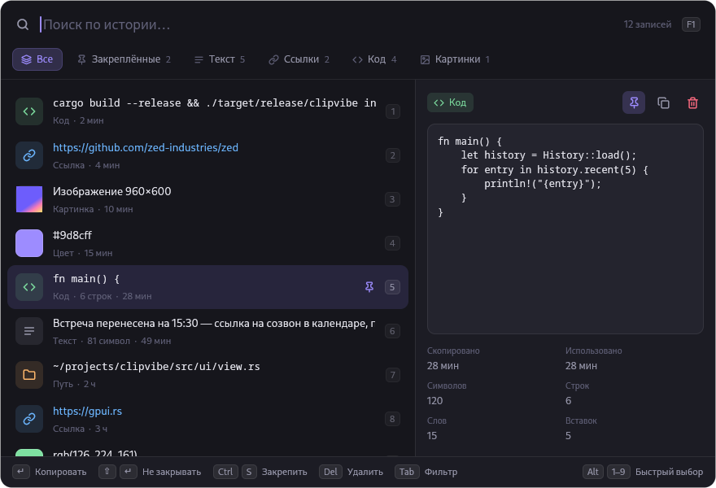

# clipvibe

История буфера обмена для Linux на [GPUI](https://gpui.rs) (UI-фреймворк Zed).
Работает с клавиатуры: нечёткий поиск, фильтры, превью, закрепление.



Скриншоты и запись экрана — отдельное приложение
[shotvibe](https://github.com/monforje/shotvibe); его снимки сами попадают в историю.

## Установка

```sh
cargo build --release
./target/release/clipvibe install
```

`install` копирует бинарник в `~/.local/bin`, добавляет демон в автозапуск
(`~/.config/autostart/clipvibe-daemon.desktop`), ярлык в меню приложений и
хоткей GNOME **Super+Shift+V**.

## Использование

| Клавиши | Действие |
|---|---|
| набор текста | нечёткий поиск (несколько слов — все должны совпасть; понимает неправильную раскладку: `пше` → `git`) |
| `↑ ↓`, `Ctrl J/K`, `Ctrl N/P` | навигация |
| `PgUp PgDn`, `Home End`, `Alt ↑/↓` | прыжки |
| `Tab` / `Shift Tab` | фильтр: Все · Закреплённые · Текст · Ссылки · Код · Картинки |
| `Enter`, двойной клик | скопировать и закрыть |
| `Shift Enter` | скопировать, окно не закрывать |
| `Alt 1–9` / `Ctrl 1–9` | мгновенный выбор строки |
| мышь в превью | выделить фрагмент: протянуть, 2× клик — слово, 3× — строка, `Shift`+клик — расширить |
| `Enter` / `Ctrl C` при выделении | скопировать фрагмент и закрыть / не закрывая |
| `Ctrl A` | выделить весь текст превью (`Esc` снимает выделение) |
| `Ctrl S` | закрепить (закреплённое не удаляется очисткой и лимитом) |
| `Del`, `Ctrl D` | удалить запись |
| `Ctrl O` | открыть ссылку / путь / картинку |
| `Ctrl Shift Del` ×2 | очистить всё незакреплённое |
| `Ctrl Backspace`, `Ctrl U` | стереть слово / весь запрос |
| `Esc` | сбросить поиск, затем закрыть |
| `F1`, `Ctrl /` | справка |

Окно закрывается само, когда теряет фокус. Повторный запуск `clipvibe` тоже
закрывает окно, поэтому один хоткей и открывает, и закрывает. После `Enter`
содержимое лежит в буфере — вставляйте через `Ctrl V`.

CLI: `clipvibe list`, `clipvibe clear`, `clipvibe daemon`.
Переменные окружения: `CLIPVIBE_THEME=dark|light` (по умолчанию тема берётся из
системы), `CLIPVIBE_KEEP_OPEN=1` (не закрывать окно при потере фокуса).

## Как устроено

- **Демон** (`clipvibe daemon`) хранит историю в
  `~/.local/share/clipvibe/history.json`, картинки — PNG-файлами рядом;
  до 1000 незакреплённых записей.
- В GNOME на Wayland нет протокола `data-control`, поэтому буфер читается через
  XWayland: Mutter зеркалирует Wayland-буфер в X11 `CLIPBOARD`, а XFixes
  сообщает о каждой смене владельца. Опроса по таймеру нет.
- Буфер ставит тоже демон, поэтому данные доступны и после закрытия окна.
- **Окно** — отдельный короткоживущий процесс на GPUI (окно появляется примерно за 60 мс).
  С демоном общается JSON-строками через `$XDG_RUNTIME_DIR/clipvibe.sock`.

## Сборка

Нужны Rust (edition 2024) и системные библиотеки для gpui. Для Debian/Ubuntu:

```sh
sudo apt install libxkbcommon-dev libxkbcommon-x11-dev libwayland-dev libxcb1-dev \
    libfontconfig-dev libfreetype-dev libvulkan1 mesa-vulkan-drivers
```

`vendor/xattr` — пропатченный `xattr 0.2.3` (тянется через gpui → zed-async-tar):
в свежем `libc` нет `ENOATTR`, подключён через `[patch.crates-io]`.

Протестировано на Debian 13, GNOME 48 (Wayland).
